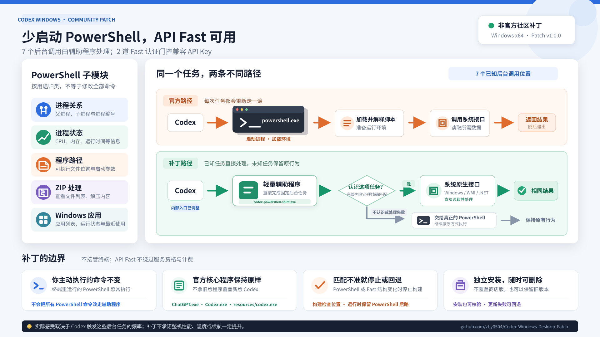

# Codex Windows Desktop Patch



这是一个非官方的 Codex Desktop Windows 优化补丁，包含 PowerShell 后台优化和 API Key 登录的 Fast 模式兼容修复。

Codex Desktop 会在后台多次启动 PowerShell，用来读取进程信息、处理压缩包和获取 Windows 应用列表。每次启动 PowerShell 都需要一点准备时间，也会短暂占用 CPU 和内存。

这个项目把其中 7 个固定的后台操作交给一个小型辅助程序直接完成，从而减少不必要的 PowerShell 启动。它不会改变你主动执行的 PowerShell 命令，也不会修改系统环境变量。

当前 Codex Desktop 还把 Fast 设置入口和请求前的配置检查限定为 ChatGPT 登录。本项目将这两道认证门控精确扩展为 `chatgpt` 或 `apikey`，使 OpenAI API Key 登录可以正常选择并请求 API Fast 服务层。API Fast 仍受 OpenAI 项目、模型和计费条件约束。

## 它有什么用

与官方版本相比，这个补丁主要带来以下变化：

- 减少 Codex Desktop 后台反复启动 PowerShell；
- 减少任务管理器中一闪而过的 `powershell.exe` 或 `pwsh.exe`；
- 降低这些后台操作带来的短时 CPU 和内存波动；
- 更稳定地找到电脑上真正安装的 PowerShell 7；
- 使用轻量的 C# WPF 图形启动器管理启动、更新和回退；
- 修复 API Key 登录时 Fast 入口不可用及请求前配置检查被拦截的问题；
- 使用独立目录安装，不覆盖 Microsoft Store 中的官方版本；
- 支持自动检查并确认更新，也可以保留旧版本用于回退。

实际提升取决于 Codex 后台操作的频率。这个补丁不能保证明显降低整机功耗、温度或所有会话的 CPU 占用。

## 与官方版本的区别

| 项目 | 官方版本 | 补丁版本 |
|---|---|---|
| 来源 | Microsoft Store 官方安装包 | 以官方安装包为基础生成 |
| 主要程序 | 官方文件 | 保持不变 |
| 后台 PowerShell 操作 | 直接启动 PowerShell | 7 个固定操作由辅助程序完成 |
| API Key 登录的 Fast 模式 | 受 ChatGPT 登录门控限制 | `apikey` 可通过设置和请求配置两道检查 |
| 用户执行的命令 | 官方行为 | 保持官方行为 |
| 安装位置 | Microsoft Store 管理 | 独立目录 |
| 更新方式 | Microsoft Store | GitHub 自动检查与确认 |
| 官方签名 | 完整保留 | 整体补丁包不再具有 OpenAI 官方签名 |

补丁不会删除进程监控功能，也不会拿旧版文件覆盖新版 Codex。官方的 `ChatGPT.exe`、`Codex.exe` 和 `resources/codex.exe` 都保持原样。

## 是否适合你

适合以下情况：

- 使用 Windows x64 版 Codex Desktop；
- 经常看到 Codex 在后台启动短暂的 PowerShell 进程；
- 使用 OpenAI API Key 登录，并且需要使用 API Fast 服务层；
- 希望补丁和官方版本分开安装，方便删除和回退；
- 能接受这是社区补丁，而不是 OpenAI 官方发布物。

以下情况建议继续使用官方版本：

- 必须使用完整的 OpenAI 官方签名；
- 电脑由企业统一管理，不允许运行社区补丁；
- 没有观察到 PowerShell 冷启动问题；
- 不需要 API Fast，或不能接受 API Fast 对应的额外 API 费用；
- 不希望自行处理 GitHub 下载和更新。

## 安装

完整的图文说明请参阅：[用户操作手册](docs/用户操作手册.md)。

运行环境：

- Windows x64；
- Microsoft .NET Framework 4.8 或更高版本（WPF 运行库）。

较新的 Windows 10 和 Windows 11 已随系统提供 .NET Framework 4.8 或更高版本，通常不需要单独安装。启动器会在进入安装、管理或启动流程前检查注册表中的 .NET Framework `Release` 值；版本过低时会显示明确错误。若 CLR v4 完全缺失或已经损坏，Windows 会在启动器代码运行前终止该托管 EXE，此时请通过 Windows Update 或 [Microsoft 的 .NET Framework 安装说明](https://learn.microsoft.com/dotnet/framework/install/on-windows-and-server) 安装或修复运行时。

1. 打开 [Releases](https://github.com/zhy0504/Codex-Windows-Desktop-Patch/releases)。
2. 下载唯一的 `CX-<Codex版本>-p<补丁版本>-bundle.zip`。
3. 把 ZIP 解压到较短的目录，例如 `C:\CodexDesktopPatchInstaller`。
4. 双击 `CodexPatchLauncher.exe`。
5. 按提示选择安装目录、自动更新检查、快捷方式和安装后启动。

> `2.1.0` 起首次安装、日常启动和自动更新均由同一个 C# WPF EXE 完成，不再随包提供 CMD 或 PowerShell 安装器。请完整解压 bundle 后再启动 EXE。

默认安装位置：

```text
%LOCALAPPDATA%\Programs\CodexDesktopPatch
```

安装完成后，桌面和开始菜单会各提供两个入口：

- `Codex Desktop Patch`：直接启动当前补丁版 Codex，不打开管理界面；
- `Codex Desktop Patch 管理器`：打开启动器 GUI，进行更新、版本管理、校验和修复。

图标修复版本会使用两种图标：彩色环形图标用于直接启动，带齿轮标识的深色图标用于管理器。启动器会在安装、更新和日常启动时刷新已有的桌面和开始菜单快捷方式；任务栏固定项仍需由 Windows 手动重新固定。

管理器“概览”页面的“检查并修复快捷方式”可主动检查并重建桌面和开始菜单中的四个固定入口，只修改本程序的固定名称，不会扫描其他快捷方式。

> bundle 中的 `CodexPatchLauncher.exe` 会在首次运行时进入安装模式；安装目录中的同名 EXE 负责启动和更新。若 `current.json` 意外丢失，但安装根目录中仍有完整且带校验标记的 `CX-...` 版本，启动器会自动选择最新版本并重建该状态文件。

> 如果旧版 Codex 仍在运行，新版可能会把启动请求交给旧版。请先从系统托盘完全退出旧版，再启动补丁版。

### 无界面安装

自动部署时，可以在解压后的 bundle 目录运行：

```powershell
.\CodexPatchLauncher.exe -InstallOnly -InstallRoot C:\CodexDesktopPatch
```

追加 `-DisableAutoUpdate` 可在安装时关闭自动更新检查。无界面安装不会创建快捷方式，也不会自动启动 Codex。

## 启动和目录

安装后的目录大致如下：

```text
CodexDesktopPatch\
├─ CodexPatchLauncher.exe
├─ current.json
├─ settings.json
├─ versions.json
└─ CX-<Codex版本>-p<补丁版本>\
```

建议始终通过安装根目录中的 `CodexPatchLauncher.exe` 或安装器创建的快捷方式启动，不要把快捷方式固定到某个版本目录里的 `ChatGPT.exe`。

## 自动更新

自动更新检查默认开启。图形启动器打开后会异步检查 GitHub Release，不会阻塞界面。发现新版后，启动器会先询问是否升级，再询问是否保留当前版本作为回退备份；两个问题的默认答案都是“是”。安装、启动、更新和回退过程均不调用 PowerShell。

- 最多每 24 小时检查一次；
- 网络失败后至少等待 1 小时再重试；
- 只有发现新版本时才下载大文件；
- 新版本安装到新目录，不会覆盖正在运行的版本；
- 更新完成后，下次启动切换到新版；
- 更新失败不会阻止当前版本启动。

选择“不升级”时不会下载新版，并会在下一次检查周期再次询问。选择“不备份”时，当前版本会在旧进程退出后由启动器排队清理；如果无法确认进程已退出，启动器会保留它以避免误删。选择“备份”不需要复制整份文件，因为每个版本本来就安装在独立目录中，旧目录就是可回退副本。

常用命令：

```powershell
$root = "$env:LOCALAPPDATA\Programs\CodexDesktopPatch"

# 只检查更新
& "$root\CodexPatchLauncher.exe" -CheckOnly -ForceUpdateCheck

# 检查并按提示下载和安装更新
& "$root\CodexPatchLauncher.exe" -UpdateOnly -ForceUpdateCheck

# 无界面自动化：接受升级并保留当前版本（两个确认项均按默认“是”处理）
& "$root\CodexPatchLauncher.exe" -UpdateOnly -ForceUpdateCheck -AcceptUpdate

# 无界面自动化：接受升级但不保留当前版本
& "$root\CodexPatchLauncher.exe" -UpdateOnly -ForceUpdateCheck -AcceptUpdate -SkipBackup

# 关闭或重新开启自动更新
& "$root\CodexPatchLauncher.exe" -DisableAutoUpdate
& "$root\CodexPatchLauncher.exe" -EnableAutoUpdate
```

单次启动不检查更新：

```powershell
& "$root\CodexPatchLauncher.exe" -NoUpdate
```

当前版本在真正启动 Codex 前，会对 7 个关键文件执行完整性校验。为减少日常启动等待，同一激活版本在最近一次完整校验成功后的 24 小时内会复用根目录的 `launch-integrity.json` 记录；首次启动、超过 24 小时、切换版本、回退、更新、修复或删除该记录后，会重新执行完整校验。打开管理器本身不会触发这组大文件校验。

这是性能和安全性的折中：24 小时窗口内，如果同一用户在校验后篡改文件，启动器不会立即发现。需要强制重新校验时，删除 `launch-integrity.json` 后再启动即可。管理器中的旧版本直接启动和“重新校验关键文件”仍然每次执行完整校验。

更新日志位于：

```text
%LOCALAPPDATA%\Programs\CodexDesktopPatch\logs\updater.log
```

## 回退旧版本

图形启动器的“版本”页面集中管理所有带有效安装标记的版本：

- 直接启动任意旧版本，不修改 `current.json`，也不改变下次默认启动版本；
- 将旧版本设为当前版本（回退）；
- 添加最多 160 个字符的备注，或固定保护重要版本；
- 异步统计并显示每个版本目录占用的磁盘空间；
- 手动删除未固定且未运行的旧版本；
- 从对应的 GitHub Release 下载原始 bundle，重新校验安装标记和 7 个关键文件，或完整替换损坏的版本目录。

“设置”页面可以限制最多保留的旧版本数量。当前版本不计入上限；固定版本计入上限但不会被自动删除。当固定版本已经达到上限时，其他未固定旧版本会优先清理。

### 关键文件校验和修复

“重新校验关键文件”会下载该安装版本对应的 GitHub Release bundle，并先验证 GitHub 提供的 bundle SHA-256、更新清单身份、bundle 内各项资产的大小和 SHA-256、校验文件以及验证报告。验证报告还必须记录有效的上游 MSIX 签名状态，并与应用 ZIP 和启动器版本一致。

Release 证据通过后，启动器会检查 `.codex-patch-install.json` 中的版本目录名、Release 标签和应用 ZIP SHA-256，并重新计算以下 7 个已安装文件的 SHA-256：

```text
ChatGPT.exe
Codex.exe
CodexPatchLauncher.exe
resources/app.asar
resources/codex.exe
resources/codex-powershell-resolver.js
resources/codex-powershell-shim.exe
```

校验能够报告安装标记不一致、路径异常、文件缺失以及文件哈希不匹配。它不会修改任何文件，也不是对安装目录中所有资源的逐文件扫描；检查范围只覆盖决定官方程序主体、补丁逻辑和启动链路的上述关键文件。

从 `1.0.0` 开始，这是一个独立的新项目。启动器只接受本仓库的 `desktop-patch` Release 标签、更新清单和下载地址，不会访问旧项目或兼容旧启动器发布格式。

“从 Release 修复”使用同一套 Release 证据，在临时目录完成下载、验证、解压和关键文件校验后，再完整替换目标版本目录。备注和固定状态保存在安装根目录的 `versions.json` 中，不会丢失。当前版本不能原位修复，请先切换到其他版本；仍有进程占用的版本也不能删除或修复。

命令行回退仍然可用：

```powershell
$root = "$env:LOCALAPPDATA\Programs\CodexDesktopPatch"

& "$root\CodexPatchLauncher.exe" `
  -RollbackTo 'CX-<Codex版本>-p<补丁版本>'
```

回退后自动更新会关闭，避免下一次启动立即切回新版。

## 卸载

1. 完全退出 Codex Desktop。
2. 删除桌面和开始菜单中的 `Codex Desktop Patch`、`Codex Desktop Patch 管理器` 快捷方式。
3. 删除以下目录：

```text
%LOCALAPPDATA%\Programs\CodexDesktopPatch
```

补丁不会覆盖 Microsoft Store 安装目录，因此删除独立目录不会破坏官方版本。

## PowerShell 7

发布包不包含 PowerShell 7，也不会帮你安装或更新 PowerShell 7。

如果电脑已经安装 PowerShell 7，补丁会优先寻找常见安装位置。找不到时会继续使用 Windows 自带的 PowerShell 5.1，因此通常不需要额外设置。

需要手动指定时，可以设置：

```powershell
[Environment]::SetEnvironmentVariable(
  'CODEX_PWSH_PATH',
  'C:\Program Files\PowerShell\7\pwsh.exe',
  'User'
)
```

如果以后移动或删除了这个 PowerShell，需要同步更新或清除 `CODEX_PWSH_PATH`。

## 它不会做什么

这个补丁不会：

- 让所有 PowerShell 命令共用一个常驻窗口；
- 合并多次 Codex 工具调用；
- 消除所有 `pwsh.exe` 进程；
- 加速所有由用户主动执行的 PowerShell 命令；
- 修改 Codex 的审批、沙箱、工作目录或取消机制；
- 修改系统或用户 `PATH`；
- 自动安装 PowerShell 7；
- 为 API Key 账户提供 ChatGPT 订阅额度；
- 绕过 OpenAI 对模型、项目或服务层的可用性限制；
- 让不支持 Fast 服务层的第三方兼容接口自动获得 Fast 能力。

补丁范围仅包括 Codex Desktop 自身的 7 个固定后台操作，以及 Fast 模式的 2 道认证门控。

## 安全说明

这是社区补丁，不是 OpenAI 官方产品。

- 构建过程会先验证下载的官方 Microsoft Store 安装包；
- 官方主要程序在补丁前后保持一致；
- PowerShell 部分只修改 2 个固定逻辑文件，Fast 部分只修改结构化识别到的 `webview/assets/*.js` 资源块；
- 发布前会检查修改范围、文件哈希和压缩包内容；
- 如果新版 Codex 的内部结构发生变化，构建会停止，而不是继续盲目修改；
- 下载文件的哈希可以发现损坏，但不能防止 GitHub 仓库或发布账号本身被入侵；
- 修改后的整体包不再具有 OpenAI 官方签名。

如果你不能接受这个信任边界，请使用 Microsoft Store 中的官方版本。

## 工作原理简述

官方版本执行部分后台任务时，会启动 PowerShell、解析一段脚本、读取结果，然后退出。

补丁会把这 7 个固定任务交给 `codex-powershell-shim.exe`：

- 读取进程关系和进程状态；
- 读取程序路径；
- 查看和解压 ZIP；
- 获取 Windows 应用列表。

辅助程序直接使用 Windows 和 .NET 提供的功能，返回与原来兼容的结果。遇到不认识的命令或直接处理失败时，它会继续调用真正的 PowerShell，尽量保持原有行为。

构建器不会简单替换所有 `powershell.exe` 文本。它会确认目标位置和数量与预期完全一致；只要官方代码发生无法识别的变化，本次构建就会失败并停止发布。

### API Key Fast 兼容修复

当前桌面端存在 2 道与 `fast_mode` 直接关联的认证检查：一道决定 Fast 设置是否可用，另一道决定是否读取请求所需的 Fast 配置。补丁使用 JavaScript 语法树识别这两道检查，并按原有逻辑分别改为：

- 正向检查允许 `chatgpt` 或 `apikey`；
- 反向排除检查只排除既不是 `chatgpt` 也不是 `apikey` 的认证类型。

补丁不会把反向条件直接改成恒假，因此其他认证方式不会被一并放行。写入后会重新解析资源块，并核对有效 API Key 门控数量、补丁标记、文件完整性和 ASAR 逻辑差异；任一条件不符合即停止构建。

API Fast 的服务层、支持范围和计费以 [OpenAI API Fast mode 文档](https://developers.openai.com/api/docs/guides/fast-mode) 为准。这里的 API Fast 不等同于 ChatGPT 订阅额度，也不能保证第三方兼容接口支持相同服务层。

## 开发和构建

以下内容面向需要检查或修改项目的开发者。

环境要求：

- Windows x64；
- Node.js 22 或更高版本；
- Windows SDK SignTool；
- Windows 自带的 `tar.exe`；
- .NET Framework C# 编译器 `csc.exe`；
- .NET Framework 4.8 WPF 运行库。

```powershell
npm ci
npm test
npm run detect
npm run build
```

使用已经下载的官方 MSIX：

```powershell
npm run build -- --msix .\OpenAI.Codex_<version>_x64__<publisher>.msix
```

GitHub Actions 会定期检测新的官方 Windows 版本。构建成功后，每个 Release 只发布一个文件：

```text
CX-<Codex版本>-p<补丁版本>-bundle.zip
```

bundle 内包含应用文件、C# WPF 启动器、交互安装器、校验文件和构建验证报告。

## 相关项目

- [CodexDesktop-Rebuild](https://github.com/zhy0504/CodexDesktop-Rebuild)：跨平台重构和功能修改。
- [Codex-PowerShell7-OneClick-Fix](https://github.com/zhy0504/Codex-PowerShell7-OneClick-Fix)：不修改 Codex 文件，通过快捷方式调整 PowerShell 路径。
