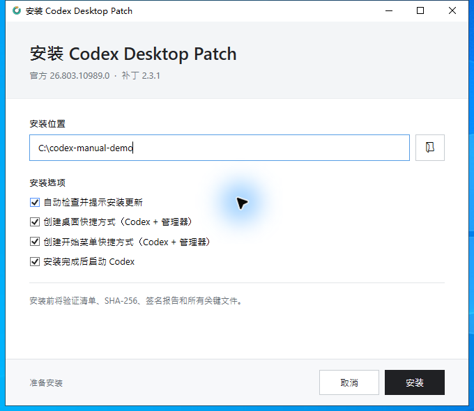
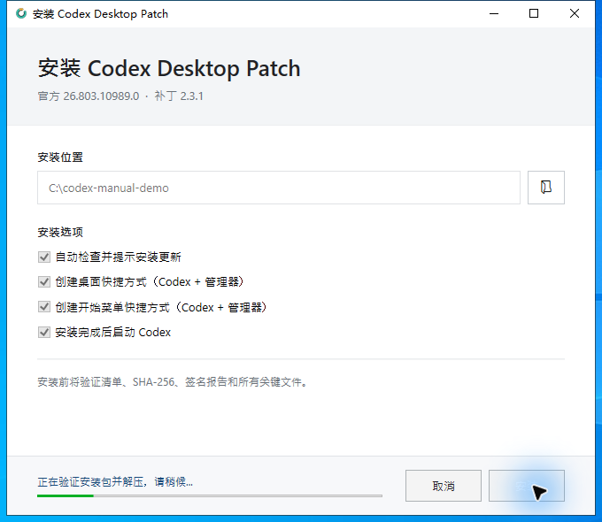
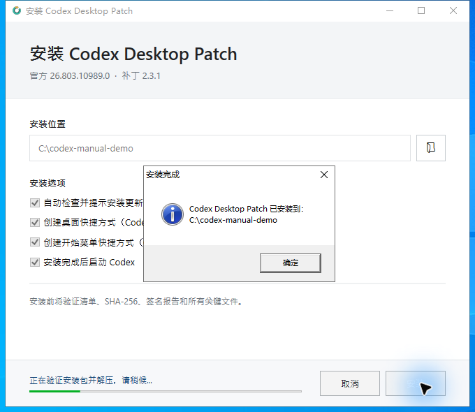
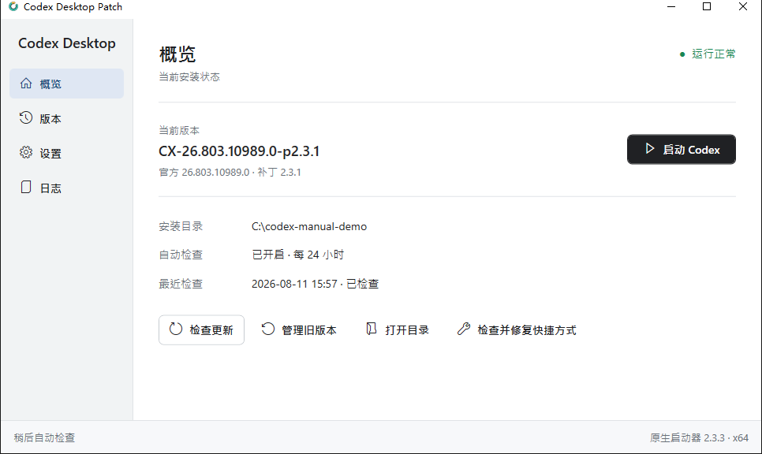
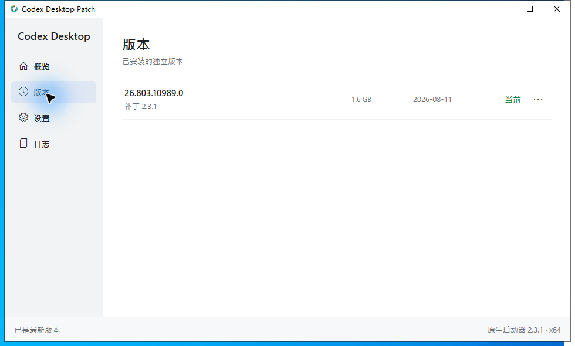
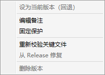
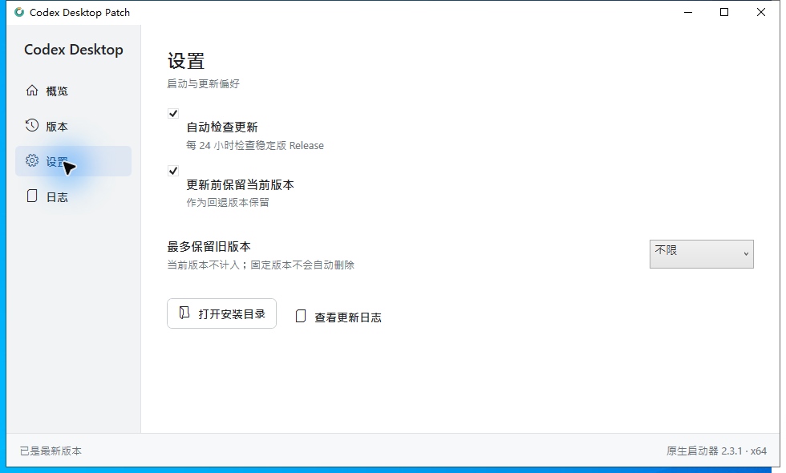
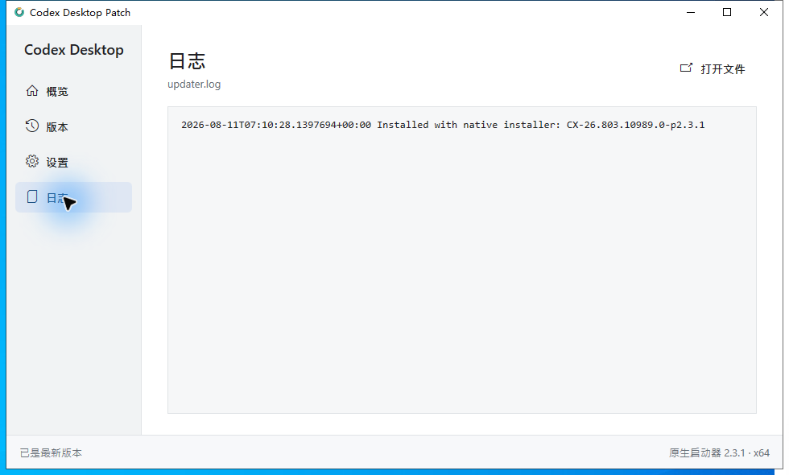

# Codex Desktop Patch 用户操作手册

适用于 Codex Windows Desktop Patch 1.0.0。本文以 Windows x64 为例，截图来自实际安装演示；截图中的 `C:\codex-manual-demo` 只是演示目录，不是固定要求。

## 1. 使用前准备

- Windows x64。
- Microsoft .NET Framework 4.8 或更高版本。
- 从 [Releases](https://github.com/zhy0504/Codex-Windows-Desktop-Patch/releases) 下载唯一的 `CX-*-bundle.zip`。
- 将 ZIP **完整解压**到本地短路径，例如 `C:\CodexDesktopPatchInstaller`。不要直接在压缩包内运行 EXE，也不要只解压其中一个文件。

启动器是未签名的社区补丁程序。发布包会校验清单、SHA-256、验证报告和关键文件，但这些校验不能替代你对 Release 来源的判断。

## 2. 首次安装

### 2.1 打开安装器

在完整解压后的 bundle 根目录双击 `CodexPatchLauncher.exe`。首次运行时它会进入安装模式，并检查 .NET、安装清单、资产文件大小和版本身份。



### 2.2 选择安装位置

在“安装位置”中填写安装根目录。默认目录是：

```text
%LOCALAPPDATA%\Programs\CodexDesktopPatch
```

也可以使用固定目录，例如 `C:\mycodex`。建议安装根目录路径短、稳定，不要放在临时下载目录或网络盘。

### 2.3 选择安装选项

- **自动检查并提示安装更新**：启用后，启动器最多每 24 小时检查一次稳定版 Release。
- **创建桌面快捷方式**：创建“Codex Desktop Patch”和“Codex Desktop Patch 管理器”两个桌面快捷方式。
- **创建开始菜单快捷方式**：在开始菜单中创建同样的两个入口。
- **安装完成后启动 Codex**：安装成功后直接启动当前 Codex，不打开管理器。

快捷方式指向安装根目录中的 `CodexPatchLauncher.exe`，不会固定到某个版本目录里的 EXE。

### 2.4 开始安装

点击“安装”后，程序会验证 bundle、校验 ZIP 和报告、解压应用、验证关键文件、写入当前版本状态，并创建快捷方式。安装过程可能持续数分钟，取决于磁盘速度和杀毒软件扫描速度。



安装期间不要关闭窗口、删除 bundle 或手动修改目标目录。



## 3. 两个启动入口

安装后通常有两个入口：

| 入口 | 用途 |
| --- | --- |
| `Codex Desktop Patch` | 直接启动当前补丁版 Codex，不打开管理器 |
| `Codex Desktop Patch 管理器` | 打开管理器，进行更新、版本、设置、日志和修复操作 |

安装根目录中的 `CodexPatchLauncher.exe` 是管理器和启动分发入口；版本目录中的 `CodexPatchLauncher.exe` 是随该版本保存的启动器副本，用于完整性校验、回退和修复。不要把快捷方式指向版本目录中的副本。

图标修复版本会使用两种图标：彩色环形图标表示“直接启动 Codex”，带齿轮标识的深色图标表示“启动管理器”。启动器在安装、更新和日常启动时会刷新已有的桌面和开始菜单快捷方式。任务栏固定项仍由 Windows 管理，换安装目录后可能需要手动重新固定。

## 4. 管理器概览

双击“Codex Desktop Patch 管理器”，可以看到当前版本、安装目录、自动检查状态和最近一次检查结果。



常用操作：

- **启动 Codex**：启动当前激活版本。
- **检查更新**：立即检查 GitHub Release；不会每次都下载大文件，只有确认有新版本后才下载。
- **管理旧版本**：进入版本页面。
- **打开目录**：打开安装根目录。
- **检查并修复快捷方式**：检查桌面和开始菜单中的 4 个固定入口，修复目标、启动参数和图标不正确的快捷方式，并重新创建缺失的入口。

### 4.1 检查并修复快捷方式

当快捷方式图标相同、点击后没有进入预期模式，或快捷方式被误删时，在“概览”页面点击“检查并修复快捷方式”。确认后，管理器会检查以下固定入口：

- 桌面：`Codex Desktop Patch.lnk`、`Codex Desktop Patch 管理器.lnk`。
- 开始菜单：`Codex Desktop Patch.lnk`、`Codex Desktop Patch 管理器.lnk`。

检查内容包括快捷方式是否指向安装根目录的 `CodexPatchLauncher.exe`、直接启动入口是否带 `-NoUpdate`、管理器入口是否没有该参数，以及两个入口是否使用正确图标。缺失或配置不正确的固定入口会被修复或重新创建；其他软件的快捷方式、用户自行改名的快捷方式和任务栏固定项不会被修改。操作完成后，结果窗口会分别显示正常、已修复、已创建和失败的数量。

当前版本真正启动前会进行关键文件完整性校验。最近一次完整校验成功后的 24 小时内，会复用 `launch-integrity.json` 记录，以减少启动等待。安装、更新、回退、修复和手动校验仍会执行完整校验。

## 5. 版本管理

点击左侧“版本”，可以看到已安装的独立版本、补丁版本、目录大小、安装日期和当前标记。



点击某个版本右侧的操作菜单，可以执行：



- **设为当前版本（回退）**：切换下次默认启动的版本。回退后自动更新会关闭，避免立即切回新版。
- **编辑备注**：为版本添加最多 160 个字符的说明。
- **固定保护**：固定重要版本，防止自动清理。
- **重新校验关键文件**：从对应 Release 获取证据并重新计算 7 个关键文件的 SHA-256。
- **从 Release 修复**：重新下载并验证对应版本，再完整替换损坏目录。当前版本不能原位修复。
- **删除版本**：只能删除非当前、未固定且没有运行进程的版本。

## 6. 设置

点击左侧“设置”。



- **自动检查更新**：打开或关闭稳定版 Release 检查。
- **更新前保留当前版本**：保留旧版本用于回退。由于每个版本独立存放，保留旧版本不需要复制整份文件。
- **最多保留旧版本**：限制自动保留的旧版本数量。当前版本不计入上限，固定版本不会被自动删除。

## 7. 日志

点击左侧“日志”查看 `updater.log`。它记录安装、更新、回退、修复、清理和错误信息。



日志文件位置：

```text
%LOCALAPPDATA%\Programs\CodexDesktopPatch\logs\updater.log
```

## 8. 更新

默认情况下，管理器最多每 24 小时检查一次更新：

1. 发现新版本后询问是否升级。
2. 再询问是否保留当前版本作为回退备份。
3. 在临时目录下载并验证 bundle、GitHub digest、清单、报告和关键文件。
4. 将新版本安装到新的 `CX-...` 目录。
5. 原子切换 `current.json`，下次启动使用新版本。

更新失败不会覆盖当前可用版本。

## 9. 命令行用法

以下命令在 PowerShell 或命令提示符中运行。路径包含空格时请使用引号。

```powershell
$root = "$env:LOCALAPPDATA\Programs\CodexDesktopPatch"

# 单次启动不检查更新
& "$root\CodexPatchLauncher.exe" -NoUpdate

# 只检查更新
& "$root\CodexPatchLauncher.exe" -CheckOnly -ForceUpdateCheck

# 检查并按提示更新
& "$root\CodexPatchLauncher.exe" -UpdateOnly -ForceUpdateCheck

# 无界面安装。此模式不会创建快捷方式，也不会启动 Codex
& ".\CodexPatchLauncher.exe" -InstallOnly -InstallRoot C:\CodexDesktopPatch

# 关闭或开启自动更新
& "$root\CodexPatchLauncher.exe" -DisableAutoUpdate
& "$root\CodexPatchLauncher.exe" -EnableAutoUpdate

# 回退到指定版本
& "$root\CodexPatchLauncher.exe" -RollbackTo 'CX-<Codex版本>-p<补丁版本>'
```

`-NoUpdate` 只关闭本次更新检查，不会跳过启动所需的完整性策略；24 小时缓存有效时会复用最近一次完整校验结果。

## 10. 卸载和重新安装

当前版本没有独立的卸载向导。卸载步骤：

1. 完全退出 Codex Desktop，包括系统托盘中的进程。
2. 删除桌面和开始菜单中的以下快捷方式：
   - `Codex Desktop Patch.lnk`
   - `Codex Desktop Patch 管理器.lnk`
3. 删除安装根目录，例如 `C:\mycodex` 或默认的 `%LOCALAPPDATA%\Programs\CodexDesktopPatch`。

如果只删除安装目录而不删除快捷方式，快捷方式会暂时变成失效链接。重新安装到同一路径并在图形安装器中勾选创建快捷方式后，链接会被覆盖并恢复；如果安装到新路径，应手动清理旧链接并重新固定任务栏图标。

安装器不负责创建或删除任务栏固定项。任务栏固定到旧路径时，换安装目录后需要手动取消固定并重新固定。

删除补丁目录不会删除 Microsoft Store 的官方 Codex 安装目录。

## 11. 常见问题

### 首次双击后短暂没有窗口

启动器会先检查 .NET、安装状态和 bundle 清单，然后才创建安装窗口。Windows Defender/SmartScreen、慢磁盘或从网络盘运行也可能增加等待。请确认 bundle 已完整解压到本地目录。

### 提示缺少文件或大小不符

重新解压完整的 `CX-*-bundle.zip`，确认以下文件在同一目录：

```text
CodexPatchLauncher.exe
CodexPatch-update.json
CX-*-bundle.zip
CX-*.verification.json
CX-*.zip.sha256
```

### 启动器提示需要 .NET Framework

安装 Microsoft .NET Framework 4.8 或更高版本后重试。较新的 Windows 10/11 通常已经包含该运行库；如果 CLR 完全损坏，Windows 可能在启动器代码运行前就终止程序。

### 快捷方式图标或目标不对

先打开管理器“概览”页面，点击“检查并修复快捷方式”。它会修复桌面和开始菜单中的固定入口。若仍需清理任务栏固定项，请先取消固定再重新固定；快捷方式应指向安装根目录的 `CodexPatchLauncher.exe`，不要指向 `CX-...` 版本目录。

### 安装或更新失败

先完全退出 Codex，查看管理器“日志”页面和 `updater.log`。不要手动删除当前版本目录；如版本损坏，优先使用“从 Release 修复”或重新安装。

## 12. 目录结构

安装根目录大致如下：

```text
CodexDesktopPatch\
├─ CodexPatchLauncher.exe       # 根入口、管理器和更新分发器
├─ current.json                 # 当前激活版本
├─ settings.json                # 更新和保留设置
├─ versions.json                # 备注和固定状态
├─ CodexPatchManager.ico        # 管理器快捷方式图标
├─ launch-integrity.json        # 最近一次完整启动校验时间
├─ logs\updater.log
└─ CX-<Codex版本>-p<补丁版本>\   # 独立版本目录
```
